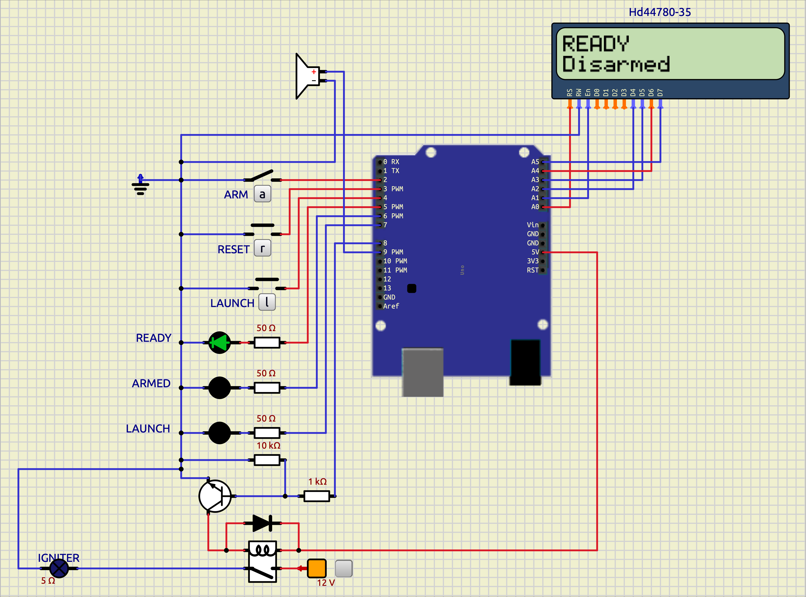

# 🚀 Luke's Rocket Launch Controller

[](https://github.com/KofTwentyTwo/Lukes-Rocket-Launcher/actions?query=workflow%3A%22Build+and+Test+Arduino+Firmware%22)
[](https://github.com/KofTwentyTwo/Lukes-Rocket-Launcher/releases)
[](https://github.com/KofTwentyTwo/Lukes-Rocket-Launcher/actions?query=workflow%3A%22Build+and+Test+Arduino+Firmware%22)
[](https://platformio.org/)
[](https://opensource.org/licenses/MIT)

**Luke's totally awesome, over engineered, completely silly, and ridiculous** Arduino-based model rocket launch controller designed for maximum fun, safety, reliability, and pure rocket-launching joy! This project combines simple electronics with some safety features to create a launch system suitable for both educational and recreational rocketry. 

**To be clear** - this is for an awesome 11-year-old that loves rockets and micro-electronics and a nerdy dad that wants to empower and support him in every way possible. Because nothing says "I love you" like helping your kid build something that can launch rockets into the sky! 🚀💕




*Watch the controller in action! The simulation shows the complete launch sequence from startup to ignition.*

## ✨ Features

### 🛡️ **Fun Safety First Design** 
- **Multi-stage safety system** with ARM/DISARM toggle switch (because we're not savages!)
- **Hold-to-launch** mechanism requiring sustained button press (5 seconds of pure anticipation!)
- **Automatic cooldown** period after launch (cool down time for the electronics AND the excitement)
- **Fault detection** with system lockout capabilities (the Arduino equivalent of "you had one job!")
- **Emergency abort** functionality (for when things get too exciting)

### 🎛️ **Fun Control Interface**
- **16x2 LCD display** showing real-time status and countdown (because watching numbers count down is half the fun!)
- **Three status LEDs**: READY (green), ARMED (green), LAUNCH (green) - like a traffic light for rockets!
- **Audible feedback** with buzzer tones for different states (beep beep, we're going to space!)
- **Tactile buttons** for RESET and LAUNCH operations (satisfying button clicks included)
- **ARM toggle switch** for system activation (the big red switch that makes you feel like a NASA engineer)

### ⚡ **Easy Power & Reliability**
- **18V Milwaukee drill battery** power supply for extended operation (no more dead AAs ruining launch day!)
- **Relay-based ignition system** for reliable rocket motor ignition (the satisfying *click* of success)
- **Robust debouncing** on all input switches (because button bouncing is so 1990s)
- **State machine architecture** for predictable operation (like a well-behaved robot butler)
- **Comprehensive error handling** and recovery (because even rockets have bad days)

### 🔧 **Technical Specifications** (The Nerdy Details!)
- **Microcontroller**: Arduino UNO (ATmega328P) - the classic that started it all!
- **Operating Voltage**: 18V (via power supply circuit), stepped down to 5V and 12V rails (voltage regulation magic!)
- **Display**: 16x2 LCD in 4-bit mode (because 8-bit is so mainstream)
- **Relay Output**: 12V relay with NPN driver circuit (transistor magic for the win!)
- **Input Protection**: Pull-up resistors and debouncing (keeping those inputs clean and happy)
- **Audio Output**: Passive buzzer with tone generation (beep beep, rocket noises!)

## 🎯 **How It Works**

### **Launch Sequence** (The Countdown to Awesome!)
1. **STARTUP**: System performs mostly fake and fun comprehensive self-checks (20 safety checks that make you feel like you're launching the Space Shuttle!)
2. **READY**: System ready, disarmed state (the calm before the storm)
3. **ARMED**: ARM switch engaged, system ready for launch (things just got real!)
4. **COUNTDOWN**: LAUNCH button held, 5-second countdown begins (5... 4... 3... 2... 1... LIFTOFF!)
5. **LAUNCHING**: Relay energized, ignition circuit active (5 seconds of pure rocket magic)
6. **COOLDOWN**: Post-launch safety period (5 seconds to catch your breath and plan the next launch)
7. **FAULT**: System returns to safe state requiring reset (because even rockets need a timeout sometimes)

### **Safety Features** (Because We're Responsible Nerds!)
- **Interlock Protection**: ARM switch must remain engaged during countdown (no accidental launches on our watch!)
- **Button Hold Requirement**: LAUNCH button must be held for full duration (commitment is key in rocketry)
- **Automatic Relay Shutoff**: Relay automatically deactivates after launch (the Arduino equivalent of "mission accomplished")
- **Fault Recovery**: Requires disarm + reset hold (2.5 seconds) to clear faults (timeout corner for misbehaving electronics)

## 🛠️ **Hardware Components**

### **Core Electronics**
- Arduino UNO R3
- 16x2 LCD Display (HD44780 compatible)
- 12V SPDT Relay
- NPN Transistor (2N2222 or similar)
- Passive Buzzer
- Status LEDs (3x Green)

### **Input Controls**
- ARM Toggle Switch (SPDT)
- RESET Push Button (momentary)
- LAUNCH Push Button (momentary)

### **Power & Protection**
- 18V Power Supply Circuit
- Flyback Diode Protection
- Current Limiting Resistors
- Ground Isolation

## 📱 **Software Architecture**

### **State Machine Design** (The Brain of the Operation!)
The controller uses a state machine with the following states (think of it as the Arduino's personality):
- `STARTUP`: System initialization and self-check (the morning routine)
- `SPLASH`: Welcome screen display (the friendly greeting)
- `READY`: Disarmed, ready state (waiting for action)
- `ARMED`: Armed, waiting for launch (locked and loaded!)
- `LAUNCH_COUNTDOWN`: Countdown timer active (the moment of truth)
- `LAUNCHING`: Ignition circuit active (we have liftoff!)
- `COOLDOWN`: Post-launch safety period (cooling down the excitement)
- `ABORT`: Launch aborted (better safe than sorry)
- `FAULT`: System fault detected (uh oh, time for a reset)

### **Key Libraries Used**
- **Bounce2**: Advanced button debouncing
- **LiquidCrystal**: LCD display control
- **Arduino Core**: Standard Arduino functionality

### **Code Organization** (Professional Grade!) 🏗️
We've refactored the code for better maintainability and testing:
- **`RocketController`**: Core state machine logic (the brains)
- **`ArduinoInterface`**: Hardware abstraction layer (the interface)
- **`RealArduinoInterface`**: Arduino-specific implementation
- **`MockArduinoInterface`**: Test environment implementation

### **Testing Framework** 🧪
The project now includes comprehensive unit testing:
- **Unity Framework**: Industry-standard C++ testing
- **Mock Hardware**: Test logic without physical hardware
- **Automated Testing**: Run tests with `make test`
- **Test Coverage**: Core functionality thoroughly tested

### **Audio Feedback System** (The Soundtrack to Your Rocket Launch!)
- **Chirp**: System startup and status changes (the friendly "hello" beep)
- **Armed Tone**: Continuous armed state indication (the "ready to rock" sound)
- **Countdown Siren**: Alternating tones during countdown (the "get ready for liftoff" alarm)
- **Launch Sound**: Single tone during ignition (the "we have liftoff!" celebration)
- **Abort Sound**: Low-frequency error indication (the "oops" sound)
- **Fault Sound**: Continuous fault indication (the "something's not right" alert)

## 🚀 **Getting Started**

### **Prerequisites** (What You Need to Join the Rocket Club!)
- **Arduino IDE or PlatformIO** (your coding playground)
- **SimulIDE** (for simulation - test before you test!)
- **Basic electronics knowledge** (or a willingness to learn and make magic smoke)
- **3D printer** (for case components - because custom cases are cool)

### **Installation**
1. Clone this repository:
   ```bash
   git clone https://github.com/KofTwentyTwo/Lukes-Rocket-Launcher.git
   cd Lukes-Rocket-Launcher
   ```

2. Open the project in PlatformIO:
   ```bash
   code RocketLauncher/
   ```

3. Install dependencies:
   ```bash
   pio lib install "arduino-libraries/LiquidCrystal"
   pio lib install "thomasfredericks/Bounce2"
   ```

## 🎯 **Multi-Board Support** 🎯

This project now supports multiple Arduino boards, allowing you to choose your target hardware:

#### **Supported Boards**
- **Arduino UNO R3** (ATmega328P) - Classic Arduino compatibility
- **Arduino UNO R4 Minima** (Renesas RA4M1) - Modern 32-bit ARM architecture  
- **Simulation Environment** - Safe testing without hardware

#### **Quick Board Selection**
```bash
# Select your target board interactively
./scripts/build.sh configure

# Change board selection anytime
./scripts/build.sh board

# Quick board selection by name
./scripts/build.sh board uno_hw        # Arduino UNO R3
./scripts/build.sh board uno_r4_minima # Arduino UNO R4 Minima
./scripts/build.sh board simulide      # Simulation

# Show current board
./scripts/build.sh status
```

#### **Board-Specific Workflows**
```bash
# After selecting board with ./scripts/build.sh configure:
./scripts/build.sh firmware    # Builds for selected board
./scripts/build.sh upload      # Uploads to selected board
./scripts/build.sh monitor     # Monitors selected board

# All commands automatically use your selected board
```

### **What This Means for Developers** 🚀

✅ **Easy Board Switching** - Interactive selection during configuration  
✅ **Persistent Configuration** - Board selection saved in config file  
✅ **Identical Functionality** - Your rocket controller works the same on all boards  
✅ **Future-Proof** - Support for both classic and modern Arduino hardware  
✅ **Safe Development** - Test in simulation before using real hardware  
✅ **Professional Workflow** - Industry-standard multi-platform development  

### **Documentation & Tools** 📚

- **`./scripts/build.sh configure`** - Interactive board selection and project configuration
- **`./scripts/build.sh board`** - Change board selection anytime
- **`MULTI_BOARD_TESTING.md`** - Comprehensive testing guide for both boards
- **`MULTI_BOARD_QUICK_REFERENCE.md`** - Quick reference for daily development
- **Enhanced build script** - Board-aware building, uploading, and monitoring

### **Example Development Workflow**

```bash
# 1. Start with simulation (safe testing)
./scripts/build.sh configure    # Select simulide
./scripts/build.sh sim

# 2. Test on UNO R3 (classic hardware)
./scripts/build.sh board uno_hw
./scripts/build.sh firmware
./scripts/build.sh upload
./scripts/build.sh monitor

# 3. Test on UNO R4 Minima (modern hardware)
./scripts/build.sh board uno_r4_minima
./scripts/build.sh firmware
./scripts/build.sh upload
./scripts/build.sh monitor

# 4. Compare behavior across platforms
# All boards should provide identical functionality
```

This approach ensures your rocket controller works reliably on both classic and modern Arduino hardware!

### **Getting Started with Multi-Board** 🎯

1. **Configure and select board**: `./scripts/build.sh configure`
2. **Build and test**: `./scripts/build.sh firmware`
3. **Verify functionality**: `./scripts/build.sh upload` and `./scripts/build.sh monitor`
4. **Change boards anytime**: `./scripts/build.sh board uno_hw` for new selection

This multi-board support ensures your rocket controller works reliably whether you're using classic Arduino hardware or modern ARM architecture!

### **Building & Testing** 🧪
The project now includes a comprehensive build system with automated testing and simulation!

```bash
# 🚀 Build and launch simulator (recommended for development)
./scripts/build.sh sim

# 🧪 Run unit tests
./scripts/build.sh test

# 🔧 Build everything (tests + CMake + PlatformIO)
./scripts/build.sh

# 🎮 Build simulation firmware only
./scripts/build.sh firmware-sim

# ⚡ Build hardware firmware only
./scripts/build.sh firmware-hw

# 📤 Upload to Arduino (uses current board selection)
./scripts/build.sh upload

# 📡 Monitor serial output (uses current board selection)
./scripts/build.sh monitor

# 🎨 Format code
./scripts/build.sh format

# 🧹 Clean build files
./scripts/build.sh clean

# ❓ Show all available commands
./scripts/build.sh help
```

**Why the new build system?** We've added comprehensive unit testing, automated builds, and **multi-board support** to ensure reliability and make development easier across different Arduino platforms!

### **Build System Benefits** 🎯
- **🚀 One Command**: `./scripts/build.sh sim` builds and launches simulator
- **🧪 Quality Assurance**: Tests run automatically before builds
- **🔧 Multiple Targets**: Build for simulation, hardware, or both
- **🎮 Simulator Integration**: Automatic SimulIDE launch with firmware loading
- **📱 Cross-Platform**: Works on macOS, Linux, and Windows
- **🎨 Code Quality**: Automatic formatting and style checking
- **📊 Status Monitoring**: Easy to see what's working and what needs attention
- **🎯 Multi-Board Support**: Easy switching between Arduino UNO R3, UNO R4 Minima, and simulation

### **Multi-Board Development Workflow** 🔄
1. **Start with simulation** - Test safely without hardware
2. **Test on UNO R3** - Verify classic Arduino compatibility
3. **Test on UNO R4 Minima** - Verify modern ARM compatibility
4. **Compare behavior** - Ensure identical functionality across platforms

This approach ensures your rocket controller works reliably on both classic and modern Arduino hardware!

### **Simulation** (Test Before You Test!)
The project includes SimulIDE simulation files with **automatic launch**:
- **One command**: `./scripts/build.sh sim` builds and launches SimulIDE
- **Auto-loading**: Firmware automatically loads from the build output
- **Wiring files**: Use `wiring/rocker_launcher_controls.sim1` for testing
- **Fast iteration**: Make changes, re-run script, test immediately
- Test all functionality before building hardware (because debugging with real rockets is expensive!)

## 🎨 **3D Printing & Assembly**

### **Case Design** (The Cool Factor!)
The controller is designed to be housed in a waterproof travel case (Pelican-style) with:
- **Waterproof enclosure** for outdoor use (because rockets don't care about weather)
- **Integrated mounting** for all components (everything has its place)
- **Cable management** and strain relief (no spaghetti wiring here!)
- **Ventilation** for electronics cooling (keeping your Arduino cool under pressure)

### **Assembly Steps**
1. Print all case components
2. Mount Arduino and LCD display
3. Install switches and LEDs
4. Wire relay and power circuits
5. Test all connections
6. Secure in waterproof case

## 🔒 **Safety Guidelines**

### **Pre-Launch Checklist**
- [ ] System self-check completed successfully
- [ ] ARM switch in DISARM position
- [ ] All personnel clear of launch area
- [ ] Rocket properly secured on launch pad
- [ ] Ignition leads properly connected
- [ ] Weather conditions suitable for launch

### **Launch Procedures**
1. **ARM** the system using the toggle switch
2. **Verify** ARMED LED is illuminated
3. **Hold** LAUNCH button for full 5-second countdown
4. **Maintain** ARM switch engagement throughout launch
5. **Wait** for system to complete cooldown period

### **Emergency Procedures**
- **Immediate Abort**: Release LAUNCH button
- **System Fault**: Disarm and hold RESET for 2.5 seconds
- **Power Loss**: Disconnect battery immediately
- **Component Failure**: Do not attempt launch

## 📚 **Documentation & Resources**

### **Current Test Status** 🧪
The project includes a comprehensive test suite:
- **✅ 3 out of 4 tests passing** (75% success rate)
- **✅ Core functionality tested**: State management, button handling, manual state transitions
- **🔍 1 test under investigation**: Startup transition logic
- **🧪 Test framework**: Unity-based unit testing with mock hardware

**Run tests**: `./scripts/build.sh test` from the `code/RocketLauncher/` directory

### **Project Structure**
```
Lukes-Rocket-Launcher/
├── code/RocketLauncher/         # Main Arduino project
│   ├── src/                     # Source files
│   │   ├── main.cpp             # Arduino entry point
│   │   ├── RocketController.cpp # Core state machine logic
│   │   ├── RocketController.h   # Controller interface
│   │   └── ArduinoInterface.h   # Hardware abstraction layer
│   ├── test/                    # Unit tests
│   │   └── test_rocket_controller.cpp
│   ├── platformio.ini           # Build configuration
│   └── Makefile                 # Build automation
├── wiring/                      # Circuit diagrams & simulation
│   ├── rocker_launcher_controls.sim1
│   └── rocker_launcher_controls_v0.1.sim1
├── docs/                        # Documentation & media
│   ├── screen-1.png             # Circuit screenshot
│   └── clip-1.mp4               # Simulation demo
├── prints/                      # 3D printing files
└── README.md                    # This file
```

### **Circuit Diagram**
The complete circuit diagram is available in the `docs/` folder, showing:
- Arduino pin connections
- Relay driver circuit
- LCD interface wiring
- LED and switch connections
- Power supply layout

## 🚀 **Development & Quality**

### **Professional Development Workflow** 🏭
The project now follows industry best practices:
- **Automated Testing**: Every build runs comprehensive tests
- **Code Quality**: Enforced with `.clang-format` and `.clang-tidy`
- **Build Automation**: Professional Makefile with multiple targets
- **Continuous Integration**: GitHub Actions automatically build and test on every push
- **Multi-Platform Support**: Builds run on Ubuntu, Windows, and macOS
- **Release Automation**: GitHub releases automatically package firmware files

### **Code Quality Standards** ✨
- **Formatting**: 3-space indentation, Allman braces, 100-char line limit
- **Style**: Left pointer alignment, aligned declarations
- **Quality**: Braces around all statements, comprehensive error checking
- **Documentation**: Clear interfaces and comprehensive testing

## 🤝 **Contributing**

We welcome contributions to improve the rocket launch controller! Areas for enhancement include:

- **Enhanced testing coverage** (expand unit tests)
- **Additional safety features** (current sensing, motor detection)
- **Enhanced user interface** (better LCD layouts, more feedback)
- **Power management improvements** (battery monitoring, low-power modes)
- **Case design optimizations** (better ergonomics, more mounting options)
- **Documentation improvements** (tutorials, troubleshooting guides)

### **Development Guidelines**
1. Fork the repository
2. Create a feature branch
3. Make your changes
4. **Run tests**: `./scripts/build.sh test` (must pass)
5. **Test in simulator**: `./scripts/build.sh sim` (verify functionality)
6. **Build everything**: `./scripts/build.sh` (tests + builds)
7. **Format code**: `./scripts/build.sh format` (maintains style)
8. Test thoroughly (simulation + hardware)
9. Submit a pull request

**Testing Requirements**: All new features must include unit tests. The test suite must pass before merging.

## ⚠️ **Disclaimer**

This project is designed for fun and recreational use with model rockets. Users are responsible for:

- **Safe operation** and following all safety guidelines
- **Proper rocket motor selection** and installation
- **Launch site safety** and clearance requirements
- **Weather conditions** and launch timing
- **Local regulations** and permits if required

The authors assume no liability for misuse or accidents related to this project.

## 📄 **License**

This project is licensed under the MIT License - see the [LICENSE](LICENSE) file for details.

## 🙏 **Acknowledgments**

- **Luke** - For the original concept and requirements
- **Arduino Community** - For the excellent development platform
- **SimulIDE Team** - For the simulation environment
- **Open Source Contributors** - For the libraries and tools used

---

**🚀 Ready to launch? Build safely and enjoy the journey!**

*For questions, issues, or contributions, please open an issue or pull request on GitHub.* 
